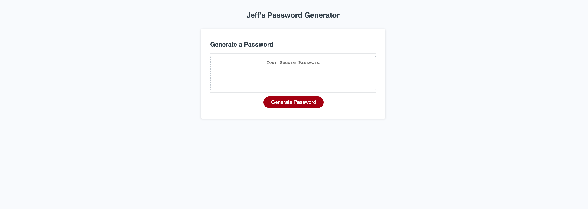

# Challenge #3 - Password Generator

## Description

This application is meant to generate random passwords using JavaScript based upon criteria chosen by the user. It was built to be responsive to all viewports. When the button is clicked, users will be asked how many characters to include in the password. Once chosen, users will then be asked if they wish to include lowercase alphabetic characters, uppercase alphabetic characters, numbers, and/or special characters. Upon selecting the desired criteria, a random password will then be generated and displayed. While and for loops were utilized in order to meet the criteria of the assignment. I feel I now have a better understanding of the JavaScript coding language after having used it in this project. 

## Installation

N/A

## Usage

Website: https://tagne13.github.io/Challenge-3/

Repository: https://github.com/Tagne13/Challenge-3.git 

## Credits

N/A

## License

N/A